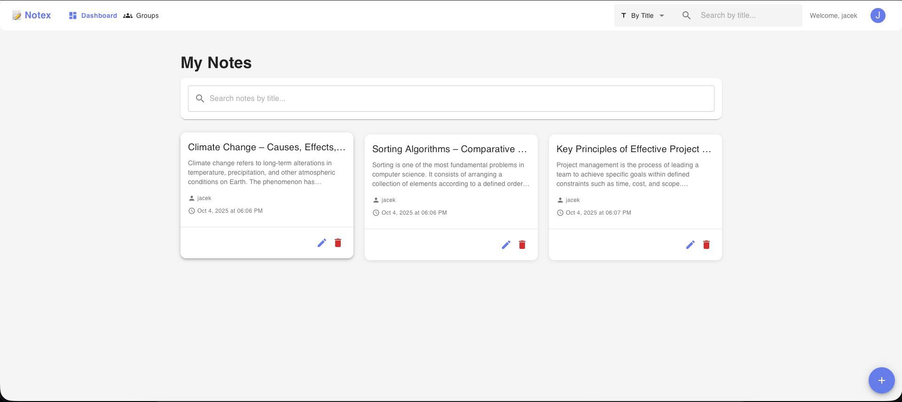
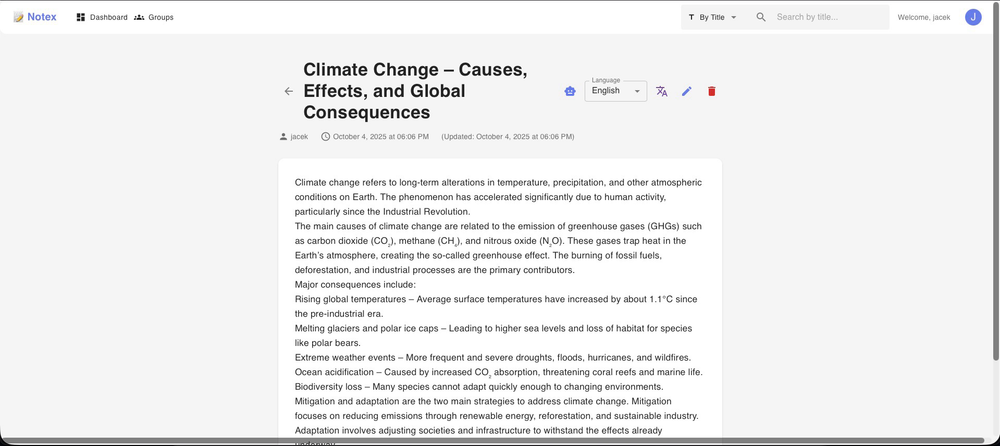
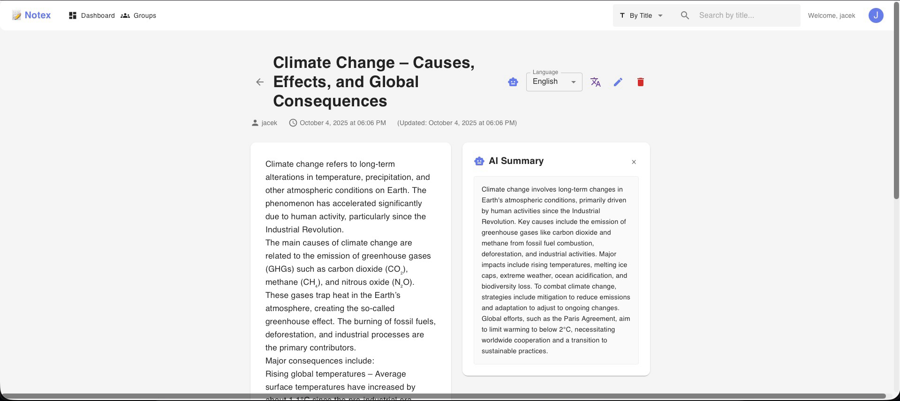
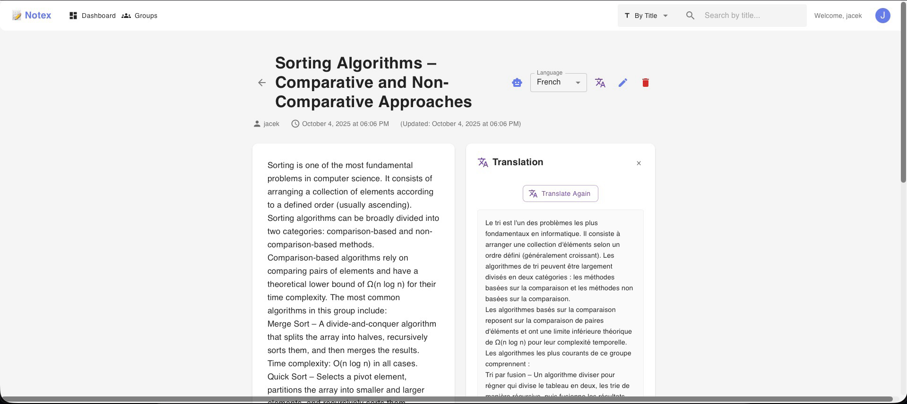
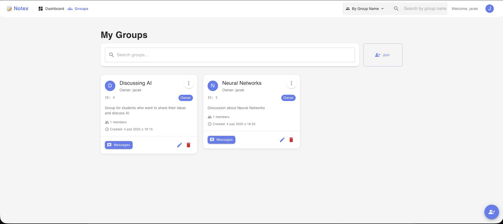

# NotEx - Note exchange platform

## Why NotEx?

I feel like there aren't too many platforms that allow students to exchange notes.
My idea was to create a web app for students to exchange notes
by posting them on a platform for everybody else to access.

## What is NotEx?
NotEx app allows users to **post their notes** and attach images and files and share them with other users.
Notes can be summarized and translated using AI.
Translations and summaries are cached and rate limited, which prevents extensive use of tokens.
Users can update and delete their notes and also create, delete and update groups. 
Users can exchange messages with other users in groups. 

**I focused on the backend side of the project**.
The frontend was implemented to showcase my backend project, and it was created with the help of AI.
It doesn't represent my frontend development skills.

If you wish to test the backend part of the project without using the frontend, you can use tools like Postman or curl to interact with the API endpoints.
**Backend has its own docker-compose file** and [README](backend/README.md) file with instructions on how to run it.

I suggest you use the full stack setup to run the project with Docker. It makes it easier to test the backend functionality.

---

## Features

- **JWT Authentication** - Secure login with token-based auth
- **Email verification** - Account verification via email code
- **Posting, updating, deleting and searching notes** - Users can post, update, delete and look up notes
- **File upload with MinIO integration** - Users can attach files to their notes
- **Creating, updating and deleting groups** - Users can create, update and delete groups
- **Sending messages** - Users can send messages to other users in groups
- **Updating user profile** - Users can update their profile
- **AI summarization** - Comprehensive notes summarization with AI 
- **AI translation** - Multi-language notes translation using AI
- **Rate limiting** - Rate limiting for API endpoints and for calls to external services
- **Caching** - Caching for frequently used data
- **Health monitoring** - Custom health indicators and metrics
- **Logging with SLF4J** - Structured logging for debugging and monitoring
- **Role-based access control** - Admin/User roles with appropriate permissions
---

## Screenshots
### Homepage


### Note view


### Note summary


### Note translation


### Group view


---
## Tech stack

- **Java 21** - Backend language
- **Spring Boot** - Backend framework
- **React** - Frontend framework
- **PostgreSQL** - Database
- **Docker** - Containerization
- **MinIO** - Object storage
- **OpenAI** - AI services
---
## Getting Started

### Prerequisites
- Docker and Docker Compose
- Git


### Windows Users - Important!
If you are working on Windows make sure you set:
```bash
git config --global core.autocrlf false
```

To check it use:
```
git config --globalcore.autocrlf
```

This allows Docker to run properly.

### Full Stack Setup
1. Clone the repository
```bash
git clone https://github.com/jacek-kozakowski/spring-boot-note-sharing.git
cd spring-boot-note-sharing
```

2. Create `.env` file in the root directory and add environment variables
```dotenv
JWT_SECRET=your-super-secret-jwt-key-change-in-production
MAIL_USERNAME=your-email@gmail.com
MAIL_PASSWORD=your-app-password
OPENAI_API_KEY=your-openai-api-key
```

You can get your app passwords [here](https://myaccount.google.com/apppasswords). You have to have 2FA enabled.

3. Run the full stack
```bash
docker-compose up -d
```

Wait until backend loads. To check if it works use:
```bash
docker logs backend-notex
```

4. Access the application
- **Frontend**: http://localhost:5173
- **Backend API**: http://localhost:8080
- **MinIO Console**: http://localhost:9001 (admin/admin12345)

## Tests
To run tests, use:

MacOS:
```bash
./mvnw test
```

Windows:
```bash
mvnw.cmd test
```

## Health Check
To check if the backend is running, use:
```bash
curl -s http://localhost:8080/actuator/health
```

## Docker Setup

### Backend Only
If you want to run only the backend for API testing:

```bash
cd backend
docker-compose up -d
```


### Services Overview
- **PostgreSQL**: Database on port 5433
- **MinIO**: Object storage on ports 9000-9001
- **Backend**: Spring Boot API on port 8080
- **Frontend**: React app on port 5173 (full stack only)

## API Documentation and Testing

For API documentation, check out [API](API.md) or backend [README](backend/README.md).
For testing use tools like Postman or curl to test the API endpoints. The backend runs on `http://localhost:8080` when started.

## Development

### Backend Development
Remember to set Java 21 as the default JDK.

```bash
cd backend
docker compose up -d
docker stop backend-notex-standalone
./mvnw spring-boot:run
```
This allows you to run the backend with containerized PostgreSQL and MinIO. Or just run the backend without containers.

### Frontend Development
```bash
cd frontend
npm install
npm run dev
```

## Testing

### Backend Tests
```bash
cd backend
./mvnw test
```


## Author
Jacek Kozakowski - [LinkedIn](https://www.linkedin.com/in/jacek-kozakowski/)

